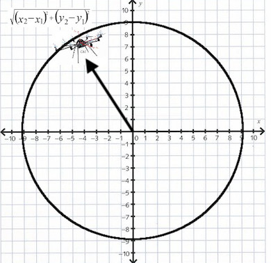

# drone-scheduler
drone-scheculer is an app which is responsible for automate the deliver of requests using drones.  This application reads instructions for plain files and triggers a drone that delivers n requests or packets to the destinations defined on the noted files.

### Prerequisites

To build and run this small app you just need to have **Java 8** or higher installed.

To check that you have Java installed just run this command:

```
javac -version
```

It should show something like: 
`javac 1.8.0_72`

Apache Maven is required as well. After you installed it, please go to the root folder and execute the following command (it is going to to execute test cases
```
mvn clean install
```

### Execution

To execute the application, please go to the src/main/java/co/com/kimera/dronescheduler/ folder and execute DroneScheduler.java file.  The user has to pass the file with the instructions as parameter.  For instance:

```
java DroneScheduler /Users/javier/in01.txt /Users/javier/in02.txt /Users/javier/in03.txt
```

### How it works?

The drone has an initial position.  Let's assume the coordinate (0,0).  When the drone starts to move in any direction (north, west, south, east), before moving to a new coordinate or position, the algorithm calculates the distance between the initial and new coordinate toward the drone is going to move.  If that distance is lesser than the limit defined by the user, the drone move forward without problems.   If the distance is higher that the limit defined by the user when initializing the drone, that one is going to return to the initial position.



